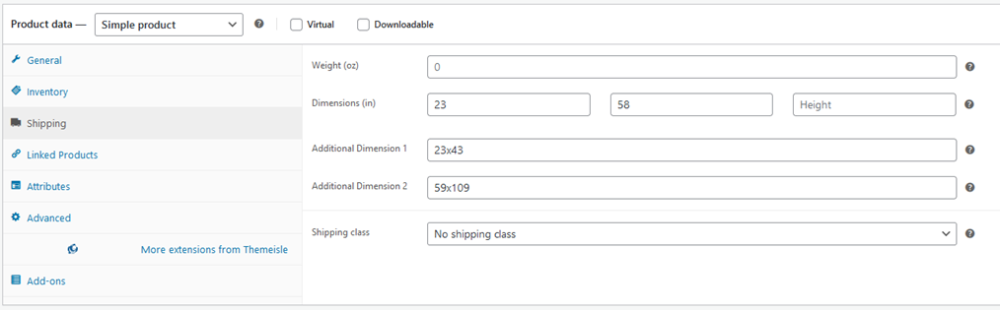

## Signing in

Sign in: <https://apexcountertopsnw.com/wp-admin/>

Quick access shortcut:
<https://apexcountertopsnw.com/wp-admin/edit.php?post_type=product>

## Creating New Remnants

1.  Before adding a new remnant <u>always</u> use the search bar to
    check if it already exists in the system. [If the remnant you want
    to add already exists follow these steps
    instead](#modify-existing-remnants), if not continue on reading.

2.  Click ‘Name’ to sort: ‘AAA111 Default Product Template’ should
    appear first in the list. Do <u>NOT</u> modify this product.

3.  Click ‘Duplicate’: Now you should see ‘AAA111 Default Product
    Template (Copy)’ as the product name.

4.  <u>Important product fields to update:</u>

*The below steps with \* are case-sensitive and formatting is important
because its customer facing*

1.  **Product Name**\*

2.  **Shipping Dimensions**: Must follow specific naming convention of
    ‘{smaller side}x{larger side}’. Note the x in the middle is
    important for the additional dimension fields (if you’re entering
    more than one). Examples: 23x59, 70x102, 48x50, also see below image
    for more examples of how it should look.

3.  **Brand Selection**: (click one of the options in the list

4.  **Product Image**: Find image of remnant online and save it. Make
    sure it doesn’t have watermarks, etc. Then on right hand side click
    ‘Remove product image’ \> ‘Set product image’ \> ‘Upload files’ \>
    ‘Select Files’

5.  **Product Tags\***: Right hand side under image. Enter 2CM or 3CM
    followed by remnant dimensions for each unique remnant*. See comment
    for how it should look formatting wise.*

6.  **Verify**: Double check all your work and click ‘Publish’ when
    finished

## Modify existing Remnants

1.  Click the product you want to update.

2.  **Update shipping dimensions & product tags** as described in the
    [Creating New Remnants](#creating-new-remnants) section under
    ‘Important fields to update’.

3.  Verify work and click ‘Publish’

## Deleting Remnants

1.  Search for the product that has been sold

2.  If the product being removed only has one size under ‘Tags’ simply
    click ‘Quick Edit’ and check the box that says ‘Private’, then
    ‘Update’. This ensures the product is hidden from customers but can
    still be used later.

3.  If the product has multiple sizes under ‘Tags’, click into the
    product and remove the size(s) from both the **Shipping Dimensions &
    Product Tags** fields.

4.  Verify work and click ‘Publish’
